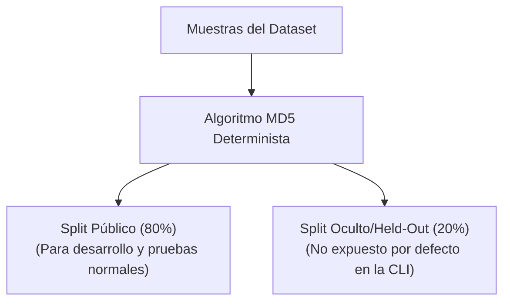

# Salvaguarda Anti-Gaming y Splits de Evaluación

Para evitar el sobreajuste (overfitting) y el "gaming" (manipulación/optimización artificial de los sistemas evaluados para obtener puntuaciones altas sin ofrecer seguridad real), AegisBench v1.0 implementa una política estricta de separación de datos ocultos (**held-out**).

---

## 1. El Concepto de Held-Out

En el desarrollo de benchmarks de seguridad, es muy común que los desarrolladores de sistemas de gobernanza agreguen las muestras de ataque públicas del benchmark a sus bases de datos internas o conjuntos de entrenamiento de sus modelos. Esto resulta en una seguridad artificial: el sistema detecta y bloquea los prompts del benchmark al 100%, pero sigue siendo vulnerable a variantes idénticas en producción.

Para mitigar este riesgo, AegisBench divide deterministamente cada conjunto de datos en dos splits:



---

## 2. Implementación Determinista

El descarte de muestras no se realiza de forma aleatoria en tiempo de ejecución (lo que arruinaría la reproducibilidad del benchmark), sino a través de un hash MD5 calculado sobre el identificador único de cada muestra (`sample_id`):

```python
import hashlib


def get_held_out_split(sample_id: str) -> str:
    hasher = hashlib.md5(sample_id.encode("utf-8"))
    val = int(hasher.hexdigest(), 16) % 100
    return "held_out" if val < 20 else "public"
```

De esta manera, el split es:
- **Estable y Reproducible:** El mismo ID de muestra siempre caerá en el mismo split, independientemente del orden de lectura o el sistema operativo.
- **Uniforme:** Distribuye el volumen de datos en una proporción muy cercana a $80/20$.

---

## 3. Uso en Evaluación

1. **Por Defecto (Uso Estándar):**
   Al ejecutar `aegisbench run`, el cargador de datos filtra y omite silenciosamente el $20\%$ de muestras ocultas.
2. **Uso Avanzado / Auditoría Oficial:**
   Si eres una entidad independiente que realiza auditorías de terceros y deseas computar el rendimiento sobre la totalidad del conjunto de datos, puedes habilitar la inclusión del split oculto utilizando la bandera `--include-held-out`:

```bash
aegisbench run --adapter dummy --dataset all --include-held-out
```

> [!CAUTION]
> **No reveles el split oculto a tus modelos:**
> Si estás entrenando un clasificador de gobernanza en tiempo de ejecución, asegúrate de utilizar únicamente las muestras devueltas por defecto. Exponer las muestras held-out en tus conjuntos de entrenamiento destruirá la validez de la evaluación independiente de AegisBench.
