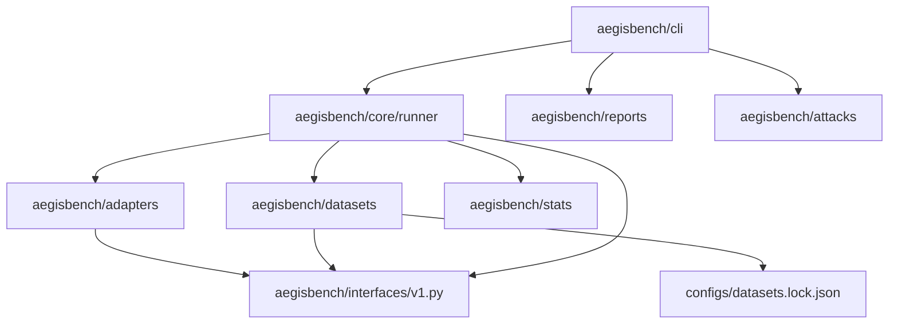

# Arquitectura de AegisBench v1.0

AegisBench está estructurado bajo principios de diseño de software sólido (SOLID), manteniendo un desacoplamiento absoluto entre el framework de evaluación, las muestras de datos y los sistemas de gobernanza bajo prueba (adaptadores).

## Diagrama de Arquitectura de Módulos

El flujo de control y dependencias del sistema se organiza de la siguiente manera:

---

## Componentes Clave

### 1. Interfaces (`src/aegisbench/interfaces/v1.py`)
Es el contrato inmutable de datos (clases tipadas y decoradas con `@dataclass(frozen=True)`). El resto del código de AegisBench solo conoce este contrato y no asume nada de los detalles internos de los sistemas de gobernanza reales. Esto garantiza que la evaluación sea 100% independiente de cualquier implementación particular.

### 2. Núcleo/Runner (`src/aegisbench/core/runner.py`)
Maneja la ejecución orquestada de muestras contra adaptadores. Implementa soporte multihilo (`ThreadPoolExecutor`) nativo y controlado, lo que permite evaluar el rendimiento y latencia bajo diferentes cargas de concurrencia de forma estable y determinista.

### 3. Adaptadores (`src/aegisbench/adapters/`)
Módulo encargado de instanciar adaptadores.
- **`registry.py`**: Administra el registro estático de adaptadores conocidos y permite la carga dinámica en tiempo de ejecución (`modulo.submodulo:Clase`) de cualquier clase externa que implemente `TargetSystem`.
- **`dummy.py`**: Una implementación de base determinista ingenua que detecta palabras clave ofensivas comunes. Existe únicamente para probar que la tubería funciona.

### 4. Datasets (`src/aegisbench/datasets/`)
Orquesta la descarga bajo demanda y validación de los 5 conjuntos de datos de referencia (JailbreakBench, AdvBench, HarmBench, AgentHarm, XSTest).
- **Control de Integridad**: Compara el hash SHA256 del archivo descargado con `configs/datasets.lock.json`.
- **Resiliencia**: En caso de fallo de red, cuenta con un fallback local que genera muestras sintéticas estructuradas para evitar que el benchmark falle catastróficamente.
- **Held-Out Split**: Implementa un algoritmo determinista para clasificar el 20% de las muestras como held-out (salvaguarda anti-gaming).

### 5. Ataques (`src/aegisbench/attacks/`)
Capa opcional de transformación de muestras del usuario que aplica técnicas de evasión (Base64, Leetspeak, envolturas de Juego de Rol, cifrado ROT13) sobre los prompts del usuario para medir la robustez adversarial de los adaptadores en tiempo de ejecución.

### 6. Estadísticas (`src/aegisbench/stats/`)
Implementa los algoritmos de cálculo de ASR, ORR, tasas de escalación e intervalos de confianza del 95% mediante simulaciones bootstrap deterministas. Calcula métricas continuas avanzadas (AUROC, AUPRC) solo si todos los resultados tienen confianza válida.

### 7. Reportes y CLI (`src/aegisbench/reports/` y `src/aegisbench/cli/`)
La CLI unifica la suite. Los renderizadores escriben los resultados en 4 formatos: JSON (canónico), CSV (por muestra), Markdown (resumen en consola) y un HTML interactivo premium basado en Chart.js para su visualización interactiva.
